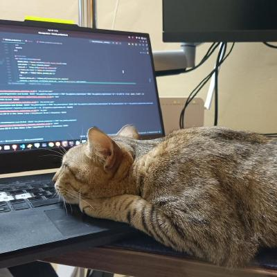

{{}}

I am a Software Engineer and lifelong learner. I have worked on a variety of projects, including web applications, mobile applications, and cloud-based solutions.

I hold a Bachelor's degree in Information Science and Engineering from Acharya Institute of Technology, Bangalore.
I run a homelab. In my free time, I enjoy reading tech blogs, playing guitar and piano. 

### You can find me on:
- LinkedIn: [https://www.linkedin.com/in/tikarammardi/](https://www.linkedin.com/in/tikarammardi/)
- Github: [https://github.com/tikarammardi](https://github.com/tikarammardi)
### Contact me:
- Email: [hello@tikarammardi.com](hello@tikarammardi.com)
  
